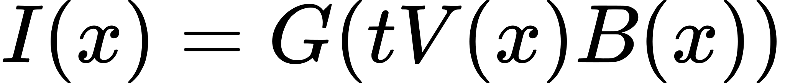
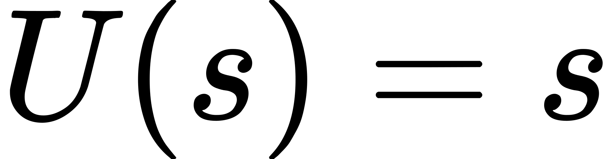
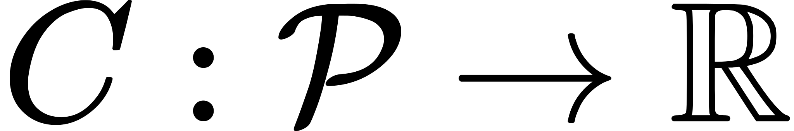
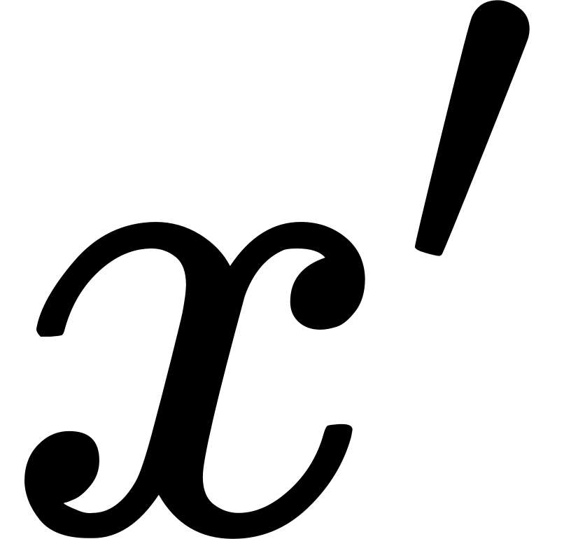

# Offline Photometric Calibration

This offline photometric calibration code can be used to estimate the inverse response function and vignetting map of a camera. This repository is a modification of [mono_dataset_code](https://github.com/tum-vision/mono_dataset_code), which was developed to perform photometric calibration for the TUM Monocular Visual Odometry Dataset [1]. The original code has been expanded to support 16-bit images, variable embedded bit depth, and additional geometric camera models.

Note: the equations are not visible in github's dark mode.

## 1. Background

This code uses the model and calibration methods described in [1].

### 1.1 Photometric Image Formation Model

Given a monochrome image, let <!-- $\Omega \subset \mathbb{R}^2$ -->  be the set of pixel coordinates in the image, <!-- $x\in\Omega$ -->  be a pixel coordinate, and <!-- $I(x)$ -->  be the observed pixel value. The photometric image formation model is given by:

<!-- $$
I(x) = G(tV(x)B(x))
$$ --> 

<div align="center"></div>

where <!-- $G$ -->  is the nonlinear camera response function, <!-- $t$ -->  is the exposure time, <!-- $V$ -->  is the vignetting map, and <!-- $B$ -->  is the irradiance image. During this photometric calibration, <!-- $I$ -->  and <!-- $t$ -->  are assumed to be known and the goal is to estimate to the inverse response function <!-- $U^{-1}=G$ -->  and the vignetting map <!-- $V$ --> . Without known irradiance <!-- $B$ --> , <!-- $U$ -->  and <!-- $V$ -->  can only be solved for up to a scale factor.

Note that <!-- $I(x)$ -->  is an unrectified image and, after calibration, photometric correction should be applied before geometric undistortion, i.e. geometric undistortion should be applied to the photometrically corrected image:

<!-- $$
I'_i(x) = t_iB_i(x) = \frac{U(I_i(x))}{V(x)}
$$ --> 

<div align="center"></div> 

### 1.2 Response Calibration

The response calibration requires a sequence of images of a static scene <!-- $I_i$ -->  with known exposure times <!-- $t_i$ --> . The irradiance <!-- $B$ -->  is assumed to be constant. Given this data, the inverse response function <!-- $U$ -->  can be found by solving the following optimization problem:

<!-- $$
\min_{U, B'} E(U, B') = \sum_{i} \sum_{x\in\Omega'} (U(I_i(x)) - t_i B'(x))^2
$$ --> 

<div align="center"></div>

where <!-- $B'(x) = V(x)B(x)$ --> , <!-- $\Omega'=\{x|x\in\Omega,I(x)\neq s\}$ --> , and <!-- $s$ -->  is the pixel value corresponding to saturation. Saturated pixels are excluded because <!-- $U(s)$ -->  is not well defined. This problem can be solved by alternatingly minimizing for <!-- $U$ -->  and <!-- $B'$ -->  while holding the other constant. The solutions to these subproblems are straightforward:

<!-- $$
U^*(k) = \underset{U(k)}{\operatorname{argmin}} E(U, B') = \frac{\sum_{i}\sum_{\Omega_{i, k}} t_i B'(x)}{\sum_{i}|\Omega_{i, k}|}
$$ --> 

<div align="center"></div>

<!-- $$
B'^*(x) = \underset{B'(x)}{\operatorname{argmin}} E(U, B') = \frac{\sum_{i} t_i U(I_i(x))}{\sum_i t_i^2} 
$$ --> 

<div align="center"></div>

where <!-- $\Omega_{i, k}=\{x|I_i(x)=k\}$ -->  and <!-- $k = 0, 1, ..., s - 1$ --> . <!-- $U(s)$ -->  is extrapolated from adjacent values. As <!-- $U$ -->  can only be solved for up to a scale factor it is rescaled such that <!-- $U(s) = s$ --> .

Note that the the final result for <!-- $U$ -->  is only well-defined if it is monotonic. This potential issue is acknowledged in [1], but the authors did not encounter it in practice and do not offer a specific solution. A previous method includes a smoothness prior in the objective function that may help in preventing this issue, but does not explicitly enforce the constraint that <!-- $U$ -->  is monotonic [2]. The authors of the [2] did not encounter the issue in practice either, but offer a way to transform the problem further to enforce the monotonic constraint. We have encountered this issue in practice, possibly due to using a camera with greater bit depth than previous examples. Instead of modifying the optimization problem and algorithm, which would increase computational complexity, we have simply added a final step to interpolate over all regions violating the monotonic constraint. In our experience, these regions are small and the correction has an insignificant affect on the value of the objective function.

### 1.3 Vignette Calibration

The vignette calibration requires a sequence of images <!-- $I_i$ -->  with known exposure times <!-- $t_i$ -->  showing a bright planar scene (such as a white wall). Let <!-- $\mathcal{P} \subset \mathbb{R}^2$ -->  be the set of coordinates along the planar surface and <!-- $x'\in\mathcal{P}$ -->  be a plane coordinate. Given a mapping <!-- $\pi_i: \mathcal{P} \rightarrow \Omega$ -->  that projects a plane coordinate to a pixel coordinate in the <!-- $i_{th}$ -->  image (if it is visible), the vignetting map <!-- $V$ -->  can be found by solving the following optimization problem:

<!-- $$
\min_{C, V} E(C, V) = \sum_{i} \sum_{x'\in\mathcal{P}} (t_iV(\pi_i(x'))C(x') - U(I_i(\pi_i(x')))^2
$$ --> 

<div align="center"></div>

where <!-- $C:\mathcal{P}\rightarrow\mathbb{R}$ -->  is the unknown irradiance of the planar surface (assumed to be constant).

In practice the plane is discretized into a square grid (1000 x 1000 by default), a mapping from the grid points to fractional unrectified pixel coordinates is found, and the values of <!-- $V(\pi_i(x'))$ -->  and <!-- $I_i(\pi_i(x'))$ -->  are interpolated from adjacent pixel values with integer pixel coordinates. The mapping from the grid points to the unrectified pixel coordinates is found by first computing a homography between the grid points and *rectified* pixel coordinates and then applying geometric distortion to yield the corresponding *unrectified* pixel coordinates. The homography is solved for using the corners of an ArUco marker detected in the *rectified* image. For this reason, this vignette calibration method requires calibrated geometric distortion parameters.

Similar to the response calibration, this optimization problem can be solved by alternatingly minimizing for <!-- $C$ -->  and <!-- $V$ -->  while holding the other constant. The solutions to these subproblems are given by:

<!-- $$
C^*(x') = \underset{C(x')}{\operatorname{argmin}} E(C, V) = \frac{\sum_{i} t_iV(\pi_i(x'))U(I_i(\pi_i(x')))}{\sum_{i}(t_iV(\pi_i(x')))^2}
$$ --> 

<div align="center"></div>

<!-- $$
V^*(\pi_i(x'))= \underset{V^*(\pi_i(x'))}{\operatorname{argmin}} E(C, V) = \frac{\sum_{i} t_i C(x')U(I_i(\pi_i(x')))}{\sum_{i} (t_iC(x'))^2}
$$ --> 

<div align="center"></div>

These values are computed for each plane coordinate <!-- $x'$ -->  in the discretized grid and the values of <!-- $V$ -->  at the integer pixel coordinates are found through interpolation. Finally, as <!-- $V$ -->  can only be solved for up to a scale factor it is rescaled such that <!-- $max(V) = 1$ --> .

## 2. Data Collection

### 2.1 Response Calibration Data

The response calibration data is obtained by recording a video of a static scene while slowly changing the exposure time. In [1] they used 1000 images covering 120 different exposure times, ranging from ~0.05ms to ~20ms in multiplicative increments of 1.05. In general, the set of exposure times should be determined through trial and error to produce a smooth inverse response result. An example from the [TUM Monocular Visual Odometry Dataset](https://vision.in.tum.de/data/datasets/mono-dataset) is the "narrow_sweep1" sequence (note: to run this code on that sequence "FOV" will need to be added to the first line of `camera.txt`, see [section 4.1.3](#413-cameratxt-file-format) for more details).

Note that the image sequence must include images with saturated pixels. The response calibration code infers the value of saturated pixels from the maximum pixel value in the response calibration sequence and sets the domain of the estimated inverse response function accordingly.

### 2.2. Vignette Calibration Data

The vignette calibration data is obtained by recording a video of an ArUco marker that is attached to a plane. The camera should be moved and rotated in many directions to ensure the video captures the plane regions across different image regions. The irradiance of the plane should remain constant throughout, so care must be taken to avoid casting shadows in the images. The images must not include anything other than the planar surface. Also. it is best to record the sequence in a brightly lit area to avoid large exposure times and blurry images. The pdf included in this repository, `marker.pdf`, contains an ArUco marker that can be printed and taped to a bright wall. An example from the [TUM Monocular Visual Odometry Dataset](https://vision.in.tum.de/data/datasets/mono-dataset) is the "narrow_vignette" sequence (note: to run this code on that sequence "FOV" will need to be added to the first line of `camera.txt`, see [section 4.1.3](#413-cameratxt-file-format) for more details).

## 3. Setup

### 3.1 Install Dependencies

The only dependencies are Eigen and OpenCV which can be installed by running:
```
sudo apt-get install libeigen3-dev libopencv-dev
```

### 3.2 Build the Code

To build the code navigate to the top level directory and run:
```
mkdir build
cd build
cmake ..
make
```

The executables `responseCalib`, `vignetteCalib` and `playDataset` will be generated in the `build/bin/` subdirectory.

## 4. Usage

### 4.1 Data Format

Data must be formatted for the `DatasetReader` which is passed a directory path. The `DatasetReader` will look in the directory for:
- `/images` - a subdirectory containing 8-bit or 16-bit single channel images
- `times.txt` - a file containing timestamps and exposure times corresponding to each image in `/images`
- `camera.txt` - a file defining the camera's geometric distortion model and parameter values
- `pcalib.txt` - a file defining the camera's inverse response function
- `vignette.png` - an image defining the camera's vignetting map

The `/images` subdirectory, `times.txt` file and `camera.txt` file are required by each executable (although geometric undistortion is not performed during response calibration). Vignette calibration additionally requires the `pcalib.txt` file. The `vignette.png` is not required by any of the executables but can be used with `playDataset`.

#### 4.1.1 Image File Format

The code only supports 8-bit and 16-bit single channel images. Each executable includes a `trueBitDepth` input to set the embedded bit depth (e.g. 12-bit data embedded in a 16-bit image). If the `trueBitDepth` is less than the bit depth of the input image file, the code assumes that the *least significant* bits are zero-padded and the pixel values will be scaled down to their true range (0 to <!-- $2^{\text{trueBitDepth}} - 1$ --> ). For example, if the input image file is 16-bit but the `trueBitDepth` is 12 each pixel value will be divided by <!-- $2^{16-12}=16$ -->  to remove the zero-padded least significant bits.

The images are associated with the lines of the `times.txt` file by sorting their filenames with `std::sort()`. One naming scheme that works is to use a 5 digit index zero padded from the left, e.g. '00000.png', '00001.png', etc.

#### 4.1.2 `times.txt` File Format

The format of the `times.txt` file is:
```
index timestamp exposure_time
```
where the exposure time is in ms. For example:
```
00000 1465049474.2675061226 0.0597894751
00001 1465049474.3674671650 0.0597894751
...
```

#### 4.1.3 `camera.txt` File Format

The geometric undistortion code was ported over from the DSO [repository](https://github.com/JakobEngel/dso) and therefore supports the same camera models [2]. The `camera.txt` file format for each camera model type is given below.

**Pre-Rectified Images**

```
Pinhole fx fy cx cy 0
in_width in_height
"crop" / "none" / "fx fy cx cy 0"
out_width out_height
```

**FOV**

```
FOV fx fy cx cy omega
in_width in_height
"crop" / "none" / "fx fy cx cy 0"
out_width out_height
```

**Radio-Tangential**

```
RadTan fx fy cx cy k1 k2 r1 r2
in_width in_height
"crop" / "none" / "fx fy cx cy 0"
out_width out_height
```

**Equidistant**

```
EquiDistant fx fy cx cy k1 k2 k3 k4
in_width in_height
"crop" / "none" / "fx fy cx cy 0"
out_width out_height
```

**Kannala Brandt**

```
KannalaBrandt fx fy cx cy k1 k2 k3 k4
in_width in_height
"crop" / "none" / "fx fy cx cy 0"
out_width out_height
```

See the respective `::distortCoordinates` implementations in  `Undistort.cpp` for the exact corresponding projection functions.

Across all models `fx fy cx cy` denote the focal length / principal point. These can specified directly or relative to the image width/height and which option was chosen is automatically inferred depending on whether `cx` and `cy` are greater than 1 (see [DSO's README](https://github.com/JakobEngel/dso#geometric-calibration-file) for more detail).

The third line specifies the rectification mode which can be one of three options:
- `crop` - the camera matrix `K` is set to crop the image to the maximal rectangular, well-defined region
- `none` - no rectification is performed (if chosen, the input image dimensions must match the output image dimensions)
- `fx fy cx cy 0` - a pinhole model is used

#### 4.1.4 `pcalib.txt` and `vignette.png` Files

The `pcalib.txt` and `vignette.png` files are output by the `responseCalib` and `vignetteCalib` executables respectively. Response calibration must be performed prior to vignette calibration. 

The `pcalib.txt` file format is a single line containing each output value of the inverse response function separated by spaces. The index of an output value in the list (starting at zero) corresponds to the input pixel value in the image (after zero padded least significant bits have been removed as described in [section 4.1.1](#411-image-file-format)). The pixel value corresponding to saturation <!-- $s$ -->  (and the largest index) should be <!-- $s = 2^{\text{trueBitDepth}} - 1$ --> , however in practice we have encountered cameras that saturate at a lower pixel value than expected. For this reason the saturation value is assumed to be the maximum pixel value seen in the response calibration sequence (as mentioned in [section 2.1](#21-response-calibration-data)) and the length of the list in `pcalib.txt` is set accordingly. After calibration, the `PhotometricUndistorter` infers the saturation value from the length of the list in `pcalib.txt` (as mentioned in [section 4.4](#44-playback)).

### 4.2 Response Calibration

The `responseCalib` executable is run as follows:
```
./responseCalib <path_to_data_directory> <option_1>=<option_1_val> <option_2>=<option_2_val> ...
```
where `path_to_data_directory` points to a directory containing calibration data as described in [section 4.1](#41-data-format). The optional inputs are specified as name-value pairs and are:
- `trueBitDepth` - the embedded bit depth, as described in [section 4.1.1](#411-image-file-format) (defaults to 12)
- `leakPadding` - an integer specifying how many pixels to discard in the vicinity of saturated pixels (defaults to 2)
- `iterations` - number of optimization iterations (defaults to 10)
- `skip` - number of frames to skip when loading data (defaults to 1, no skipped frames)

An example call is as follows:
```
./responseCalib ~/datasets/TUMCalibrationData/narrow_sweep1/ trueBitDepth=8
```

Intermediate and final results will be output to `./photoCalibResult`. This includes:
- `E-<#>.png` - the irradiance image estimate at each iteration
- `G-<#>.png` - an image depicting the plot of the inverse response function at each iteration
- `pcalib-<#>.txt` - the inverse response function at each iteration
- `pcalib.txt` - the final inverse response function
- `log.txt` - log file where each line has the following format: `iteration number_of_images number_of_residual_terms rmse`

Note that the notation here differs from [section 1](#1-background) and [1] (<!-- $B'$ -->  and <!-- $U$ -->  are `E` and `G` here). 

If no monotonic correction is necessary the final `pcalib-<#>.txt` file is the same as `pcalib.txt`. If monotonic correction is performed `pcalib.txt` differs from the final `pcalib-<#>.txt` file, an additional image `G-monotonic-correction.png` will be generated and a final line will be added to the log file.

An example of the final `G-monotonic-correction.png` image is shown below. The inverse response function output is on the y-axis and the pixel value is on the x-axis. The y-axis ranges from the minimum to the maximum inverse response function output.

<p align="center">
    
</p>

### 4.3 Vignette Calibration

The `vignetteCalib` executable is run as follows:
```
./vignetteCalib <path_to_data_directory> <option_1>=<option_1_val> <option_2>=<option_2_val> ...
```
where `path_to_data_directory` points to a directory containing calibration data as described in [section 4.1](#41-data-format). The optional inputs are specified as name-value pairs and are:
- `trueBitDepth` - the embedded bit depth, as described in [section 4.1.1](#411-image-file-format) (defaults to 12)
- `iterations` - number of optimization iterations (defaults to 20)
- `skip` - number of frames to skip when loading data (defaults to 1, no skipped frames)
- `patternX`, `patternY` - the resolution of the plane discretization (defaults to 1000 x 1000)
- `facW`, `facH` - the full size of the grid on the plane, in units of ArUco marker width (defaults to 5 x 5)

An example call is as follows:
```
./vignetteCalib ~/datasets/TUMCalibrationData/narrow_vignette/ trueBitDepth=8
```

Intermediate and final results will be output to `./vignetteCalibResult`. This includes:
- `img-<#>.png` - randomly selected input images overlaid with a coarse grid across the estimated plane
- `plane.png` - an image showing the estimated irradiance over the plane (at each point in the grid)
- `horizontalCrossSection.png`, `verticalCrossSection.png` - images depicting plots of the horizontal and vertical cross sections through the center of the vignetting map (overwritten every iteration)
- `vignetteRaw.png` - the raw vignette result prior to a smoothing step (overwritten every iteration)
- `vignette.png` - the vignette result (overwritten every iteration)
- `log.txt` - log file where each line has the following format: `iteration number_of_images number_of_residual_terms rmse`

An example of `plane.png`, `horizontalCrossSection.png` and `vignette.png` are shown below. The red pixels in `plane.png` indicate unobserved regions of the plane. In the `horizontalCrossSection.png` image the vignette value is on the y-axis and the pixel index is on the x-axis. The y-axis ranges from the mininum to maximum value across the entire vignetting map.

<p align="center">
    
</p>
<p align="center">
    
</p>
<p align="center">
    
</p>

### 4.4. Playback

The `playDataset` executable is run as follows:
```
./playDataset <path_to_data_directory> trueBitDepth=<true_bit_depth>
```
where `path_to_data_directory` points to a directory containing calibration data as described in [section 4.1](#41-data-format) and `trueBitDepth` is the embedded bit depth, as described in [section 4.1.1](#411-image-file-format). 

The images in `/images` will be displayed. Initially the playback will apply no undistortion and will pause at each image. Various keys can be used to toggle the playback settings:
- `s` - skip 30 frames
- `a` - autoplay: playback images without pausing
- `v` - apply vignette undistortion
- `g` - apply gamma undistortion
- `r` - apply geometric undistortion
- `o` - set saturated pixels to `NaN`

Note that the pixel value corresponding to saturation <!-- $s$ -->  is determined in one of two ways:
1. If `pcalib.txt` is not present, then it is assumed that <!-- $s = 2^{\text{trueBitDepth}} - 1$ --> 
2. If `pcalib.txt` is present, then <!-- $s$ -->  is set to be one less than the number of values in the file

## 5. Modifications to Original Code

The major changes to the [original codebase](https://github.com/tum-vision/mono_dataset_code) are as follows:
- Code unrelated to photometric calibration was removed
- Additional camera models were ported over from DSO (the original codebase only supports the FOV camera model)
- Support for 16 bit images and variable embedded bit depth was added

The performance has been tested against the original code on sequences from the TUM Monocular Visual Odometry Dataset [1]. The inverse response calibration results are identical and the vignette calibration results differ only slightly. The slight difference arises from the methods used to compute the "crop" camera matrix. The original code uses an exact analytical expression specific to the FOV camera model while the code ported from DSO uses an iterative method that is applicable to each camera model.

## 6. Potential Future Improvements

- Both calibration methods load all the images into memory and consume a lot of RAM, this could be improved at the expense of speed.
- Gain could potentially be added to the photometric model to allow for better low light performance. Currently, we have set gain to 0.
- Support for color images could be added, likely by applying the calibration channel-wise as suggested in [2].

## 7. References

1. J. Engel, V. Usenko, and D. Cremers, “A photometrically calibrated benchmark for monocular visual odometry,” *arXiv preprint arXiv:1607.02555*, 2016
2. E. Debevec and J. Malik, “Recovering high dynamic range radiance maps from photographs,” in *ACM SIGGRAPH 2008 classes*, 2008, pp.1–10.
3. J. Engel, V. Koltun, and D. Cremers, “Direct sparse odometry,” *IEEE transactions on pattern analysis and machine intelligence*, vol. 40, no. 3,pp. 611–625, 2017.

## 8. License

This repository includes code from the [mono_dataset_code](https://github.com/tum-vision/mono_dataset_code) and [DSO](https://github.com/JakobEngel/dso) codebases. The top level BSD license is inherited from the mono_dataset_code repository and the license in `src/undistort/` is inherited from the DSO repository.
